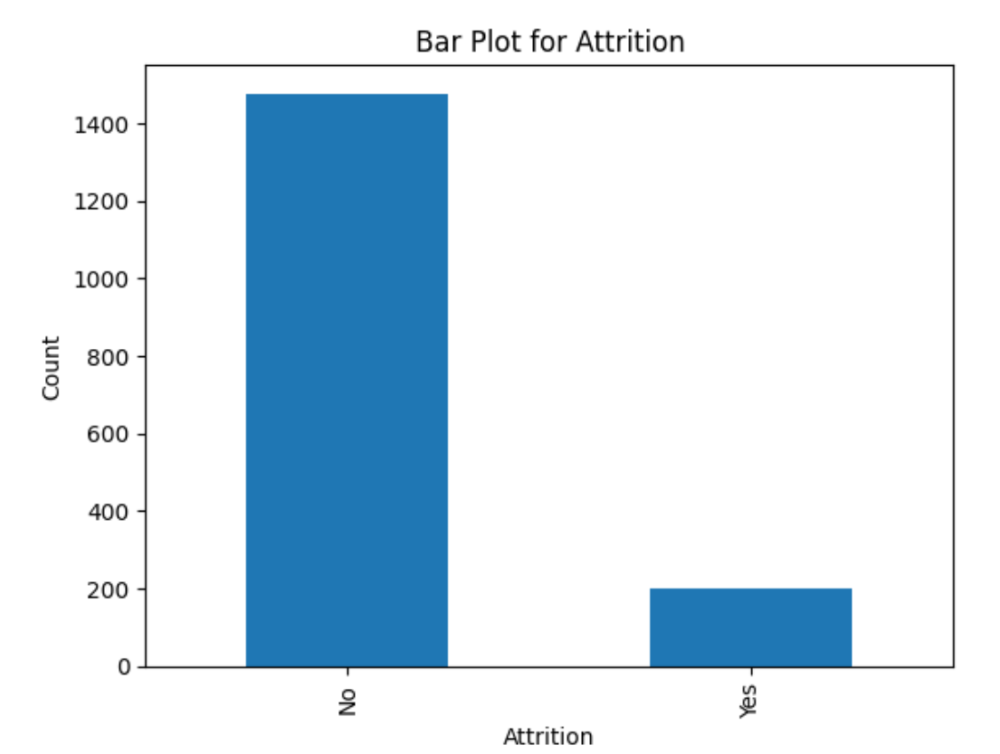
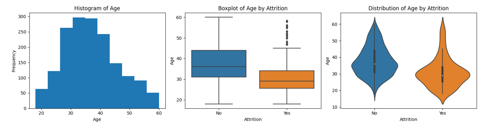
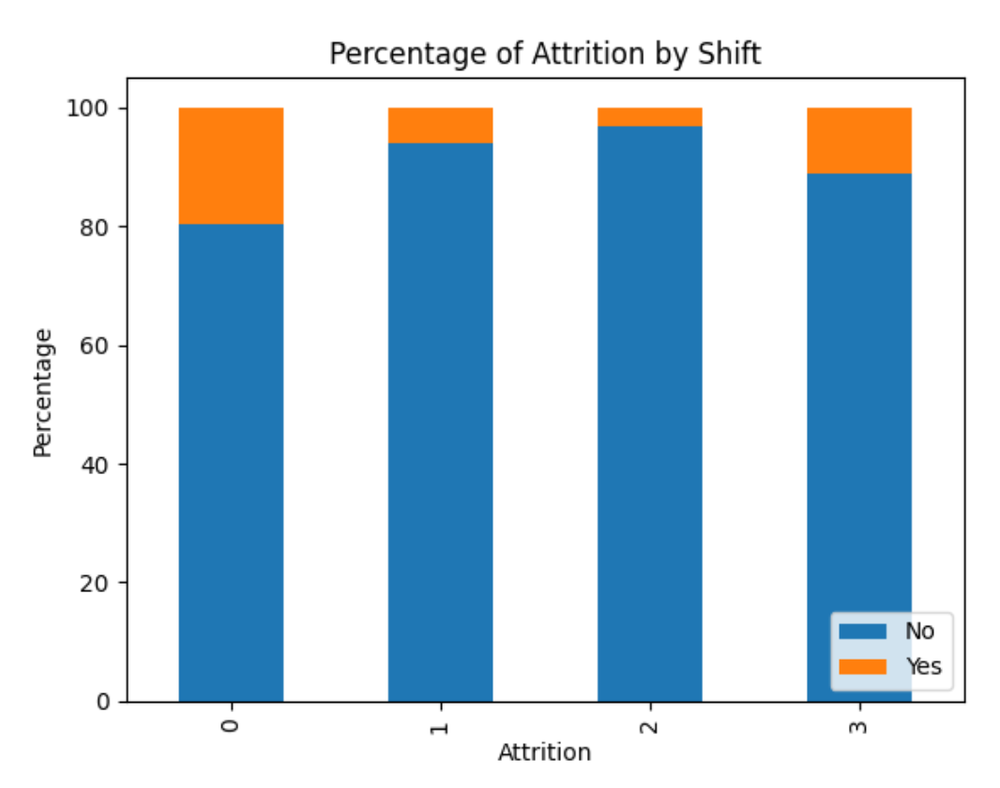
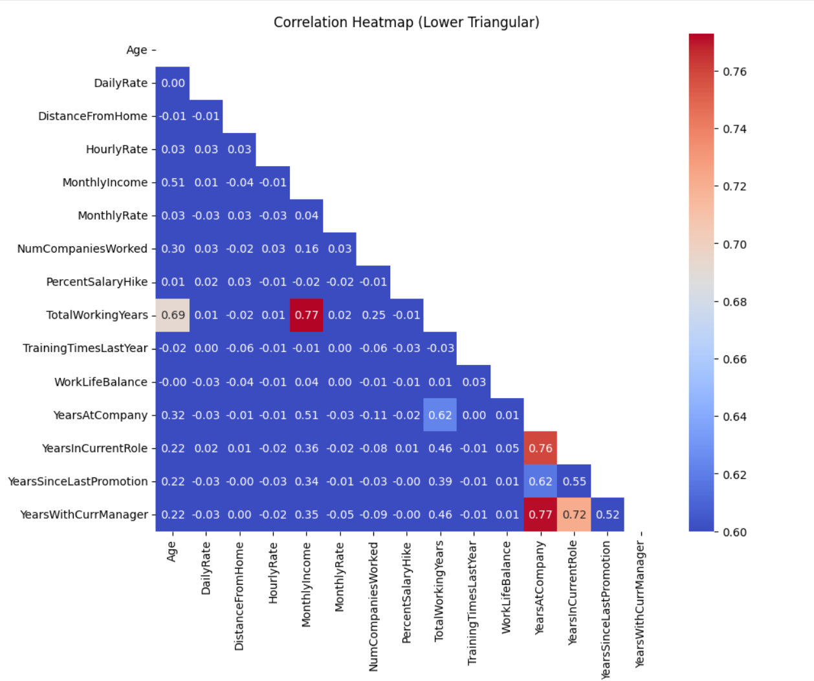
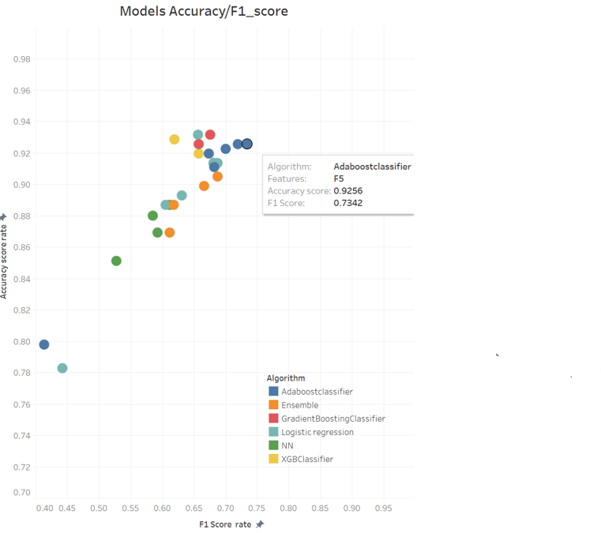
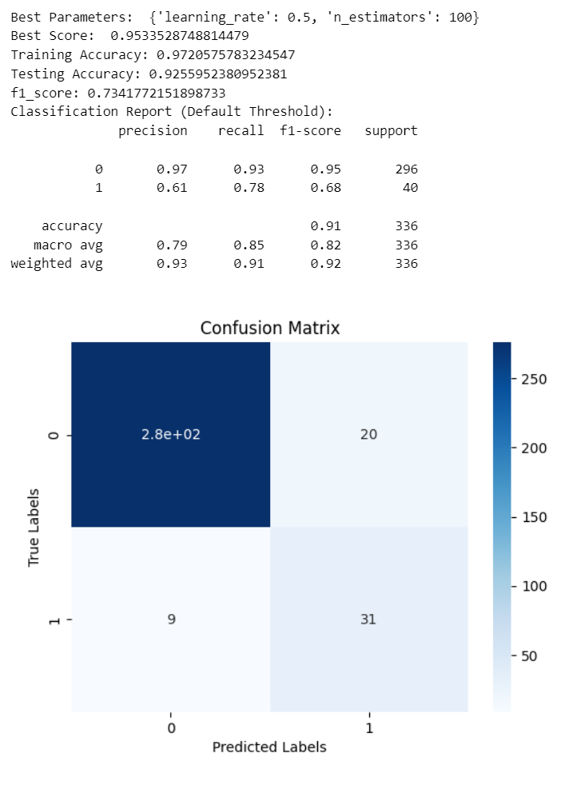
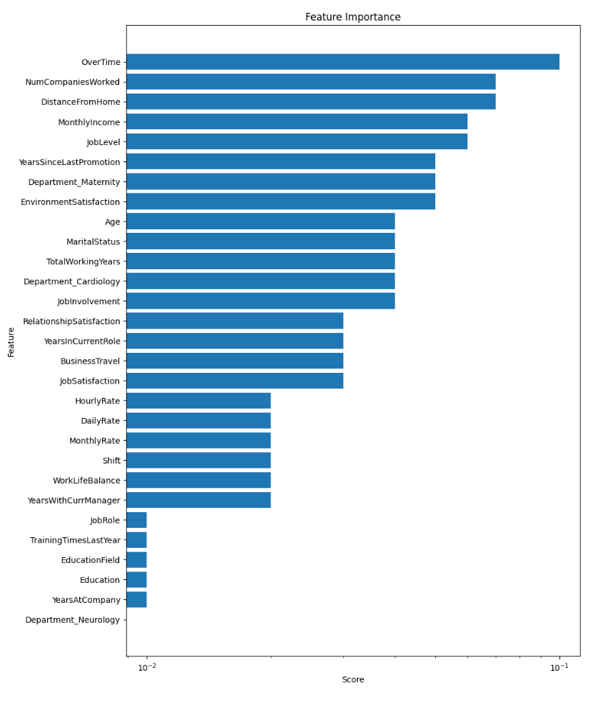
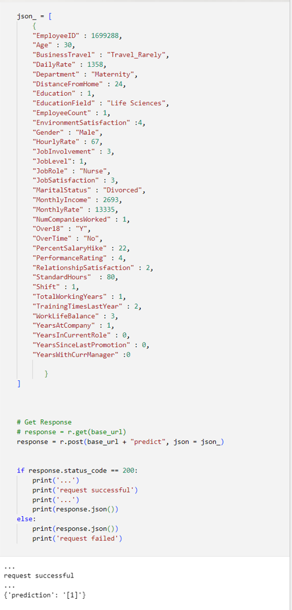
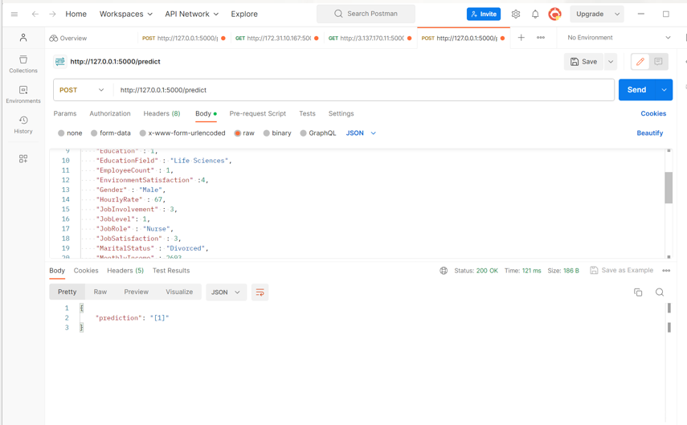

# Final project

## Project Scope

Healthcare attrition, the phenomenon of healthcare professionals leaving their positions, is a significant challenge faced by both Canada, the United States and other countries. The race of attracting and retaining healthcare providers was on for years. In addition to the existing challenges of healthcare attrition, the COVID-19 pandemic has further exacerbated the issue.
From a machine learning perspective, studying healthcare attrition in these countries can offer valuable insights and potential solutions. By analyzing healthcare data, machine learning algorithms can identify patterns and factors contributing to attrition, such as workload, job satisfaction, and burnout. These algorithms can then generate predictive models to forecast attrition rates and identify high-risk individuals or groups. Moreover, machine learning can help develop personalized interventions and strategies to mitigate attrition, such as improving work-life balance, implementing targeted retention programs, and enhancing employee satisfaction and ultimately improve the quality and accessibility of healthcare services for the benefit of both patients and professionals.

For further reading:

https://human-resources-health.biomedcentral.com/articles/10.1186/s12960-017-0195-2

https://www.mckinsey.com/industries/healthcare/our-insights/nurses-and-the-great-attrition

For this project, we will consider the US IBM Watson Healthcare Synthetic dataset. The goal is to predict Attrition: develop a binary classification model (supervised learning).
.

## Process

source:https://medium.com/@zuhailinasir_26370/data-science-process

The high levels steps include:
- understand the data (EDA and feature engineering)
- test different models (iterative process between step 1 and 2)
- select the best performing model and identify the most important features to help an HR manager to develop a retention strategy or identify employee/ group at risks
- deploy the model and identify future steps

### EDA snapshot: Data Understanding 

#### Dataset:
The Dataset is synthetic from US IBM Watson Healthcare.
- Limited data 1676 entries
- 34 features categorical and numeric (excluding our target variable attrition)
- No missing value
- light cleaning: changing data type for 2 features and jobRole administrative and admin
- dropping the following colunms: EmployeeID, Over18, StandardHours and  EmployeeCount( same value for all records)
- The classes are imbalanced with Attrition "Yes" representing 11.87%

### Analysis

To understand the dataset on hand, I visualized the pair attrition and other feature (Refer to EDA notebook for comprehensible analysis).

A sample of numerical feature:

In this case the distribution appears close to normal. The statistical hypotheses test - Shapiro reject the hypotheses on normality.

The variance between class "Yes" and "No" for Age variable is equal and the mean is not equal according the statistical tests ( T-test and Levene test respectively). The Age mean of "yes" is lower than The Age mean for "No": employees leaving are younger.

A sample of categorical feature:

Visually the percentage of Attrition for shifts 0 and 3 are higher than the two other shifts.

I also looked to the correlation factors between numerical features:

Some variables show a correlation between them with coefficient factor above 0.6. It is also confirmed statistically.

- 'MonthlyIncome'and 'TotalWorkingYears'
- 'TotalWorkingYears' and 'Age'
- 'YearsInCurrentRole' and 'YearsAtCompany'
- 'YearsInCurrentRole' and 'YearsWithCurrManager'
- 'YearsAtCompany' and 'YearsWithCurrManager'

# Features Engineering and Algorithms

## Features

### Phase 0:

At first, I hot encoded the categorical data and used the standard scaler on all the features using the following algorithms with and without Grid search and cross validation
- Logistic regression: identify well labels
- Random Forrest: blind labelling for class "yes"
- SVC: blind labelling for class "yes"
- Gradient boosting: blind labelling for class "yes"
- XGBoost classifier: blind labelling for class "yes"
- Adaboost classifier: blind labelling for class "yes"
- Ensemble Logistic regression & Adaboost: blind labelling for class "yes" ( please note this one was identified in later phases)
- Neuron Network: blind labelling for class "yes"
 [model.add(Dense(64, activation='relu')
  model.add(Dense(64, activation='relu')
  model.add(Dense(1, activation='sigmoid')]

Note: You will find an RNN on the notebook. This model is not appropriate for tabular database however for learning purpose I used this model as well but not consider further in model selection steps.

Decision:
- use the SMOTE function to balance the data.
- Consider f1_score as metric for Grid search and cross validation: we want the model to identify label yes properly (Positive true and false true)

### Phase 1:
features processing:
-	dropped the following colunms'EmployeeID','EmployeeCount','Over18','StandardHours': same value for all records.
-	replaced 'Administrative':'Admin' in JobRole
-	changed data type for shift and Education to category.
+ Hot encoding + Standard scaler+ balancing the data

All above algorithms

### Phase 2:
Phase 1 features+ dropping 'PercentSalaryHike','PerformanceRating','HourlyRate' less important features according Adaboost model
All above algorithms

### Phase 3:

Features processing
- Dropping more features according to Adaboost model and EDA
'EmployeeID','EmployeeCount','Gender','Over18','PercentSalaryHike','PerformanceRating','HourlyRate','MonthlyRate','StandardHours','YearsSinceLastPromotion'
- Grouping classes within same feature with similar attrition level
+Hot encoding + Standard scaler+ balancing the data.
   
All above algorithms
### Phase 4:
Features processing
- Dropping: 'EmployeeID','EmployeeCount','Gender','MonthlyRate','HourlyRate','Over18','PercentSalaryHike','PerformanceRating','RelationshipSatisfaction','StandardHours
- Grouping classes within same feature with similar attrition level
+Hot encoding + Standard scaler+ balancing the data

All above algorithms

### Phase 5:
Features processing
- Dropping less features aacording to adaboost model:
'EmployeeID','EmployeeCount','Gender','Over18','PercentSalaryHike','PerformanceRating','StandardHours'
- Grouping classes within same festure with similar attrition level
+ Hot encoding + Standard scaler+ balancing the data
Logistic regression and Adaboost

### Phase 6:
Using PCA and SelectKBest 10 features for feature selection based on phase1 selection.
Logistic regression and Adaboost

## Models comparison analysis:

https://public.tableau.com/app/profile/asmaa.chraibi/viz/Models_16871200378150/Sheet1

Refer to this link for more interactive visiualization.

https://public.tableau.com/app/profile/asmaa.chraibi/viz/Models_16871200378150/Sheet1

Analysis:
- All models that were blindly labelling attrition were not considered for the comparison
- Many models have an Accuracy rate beyond 90% for testing data but only Adaboost classifier had a rate above 70% with two types of features
- with PCA and SelectKBest 10 features
 , the models didn't perform well
- NN performance is less than classical ML algorithm probably because of the size of dataset.
For further comparison with parameters identified by the grid search CV refers to the excel file [Summary](<Models_features performance.xlsx>)"

# Selected Model's results 

The model selected is Adaboost classifier with Features identified in phase 5.

The features sorted by importance are:

Please note that we dropped the following features:
'EmployeeID','EmployeeCount','Gender','Over18','PercentSalaryHike','PerformanceRating','StandardHours'

# Deployment:

The model was deployed using the local machine using the terminal and Postman application

# Future steps:

- More Features Engineering
- More Data: 
    - Data Augmentation
    - Reel data from local Healthcare Facility
- Different scaler and balancing functions
- Explore and test the model in other industry.
